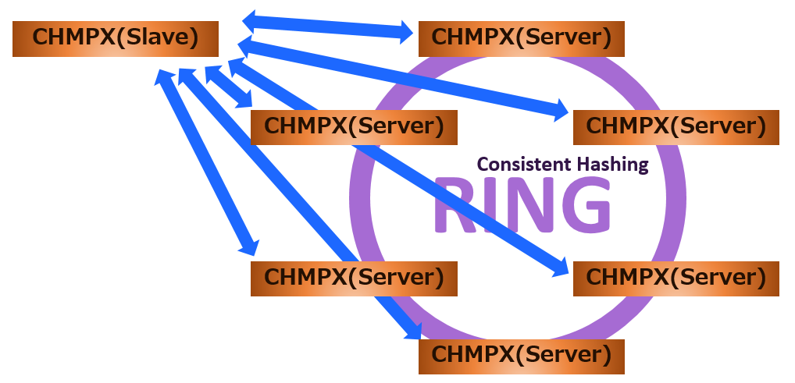

# Feature

## Flexible installation
We provide suitable CHMPX installation for your OS. If you use Ubuntu, CentOS, Fedora or Debian, you can easily install it from [packagecloud.io](https://packagecloud.io/antpickax/stable). Even if you use none of them, you can use it by [Build](https://chmpx.antpick.ax/build.html) by yourself.

## Connections
CHMPX program takes two types, server node and slave node.  
The server node operates mainly on the host on which the server program providing the resource such as data/service/function.  
The slave node operates on the host on which the client program provided with the resource is operated from the server program.  
The server node and the slave node of CHMPX are connected as follows.

## Cluster
As shown in the figure of Connections, the server node constructs a cluster by using Consistent Hashing with multiple server nodes to construct a pseudo RING.  
Server nodes on RING are aware of each other and also recognize server nodes joining in/leaving from RING.  
The slave node is always connected with the cluster consisting of multiple server nodes on RING.

## Cluster Types
The CHMPX cluster has the following two types, and there is a difference in data transmission from the slave node.

- random  
sending data from slave node to any one of server nodes in cluster.
- hash  
sending data from slave node to one of server nodes in cluster. The termination server node is selected by Hash calculated based on Consistent Hashing.

The reply from the server node to the slave node is sent by specifying the slave node.  
Whichever type is configured above, it is possible to send data from the slave node to all the server nodes in the cluster as a broadcast.

## Multiplexed Server Nodes
For a cluster of hash type, it communicates to one server node calculated based on Consistent Hashing.  
However, the terminating server node may not communicate due to a failure.  
In this case, CHMPX can communicate to secondary server node according to the configuration.  
With this secondary server node, CHMPX can continue to provide service even if a server node in the cluster fails.

The number of secondary server nodes can be set to 0 or more.  
For example, if you set 2, you can continue to provide service even if two failures occur.

## Scale for Cluster
The CHMPX cluster is designed so that server nodes can join/leave the cluster at anytime.  
For example, you can add server nodes at any time and scale out clusters when cluster resources run out of resources.  
In addition, CHMPX can automate scale-out(in) processing and can provide autoscale.

When the scale of the resources (data) that the server program has is necessary, you can build and provide an "auto data merge" using the auto scale function and data merge function provided by CHMPX.

## Communication Data
There is no restriction on the data format of communication using CHMPX, and it is possible to communicate binary data.

CHMPX does not limit the upper limit of communication data.  
Therefore, it supports transmission and reception of large data.  
The upper limit of the data size is limited by the system or [K2HASH](https://k2hash.antpick.ax/).

## Communication Encryption
CHMPX supports SSL/TLS connection between CHMPX.

## Communication Multiplexing/Parallel Processing
All communication between server/client program and CHMPX, between CHMPXs can be multiplexed.  
In the CHMPX program or server/client programs, even if one data is being transmitted or received, another data can be sent and received.  
In the CHMPX program, it is possible to set the number of threads to handle transmission/reception and to provide parallel processing.

## Queuing Communication Data
The CHMPX program can queue sent and received data.  
As a result, CHMPX can continue to provide functions without problem.  
Please take care, if the failure period is too long, probably the communication data will overflow.

## Multi-Processes and Multi-Threads
CHMPX library can be linked from the server/client program which is for multi processes program and multi threads program.  
Thus server/client programs can connect to CHMPX program whichever multi processes and multi threads.  
Thus server/client programs which uses multi processes or multi threads can connect and communicate to CHMPX program without taking care for anything.
