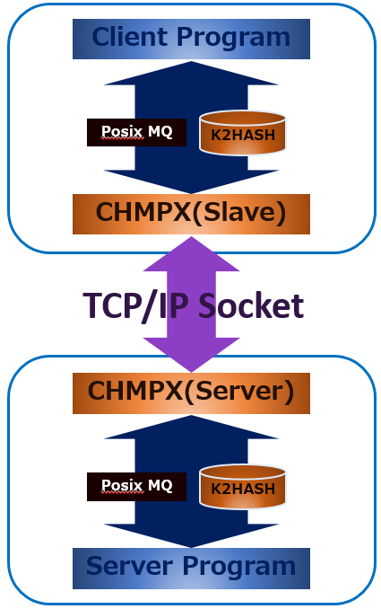

# CHMPX
**CHMPX** (**C**onsistent **H**ashing **M**q in**P**rocess data e**X**change) は、ネットワークを跨ぐプロセス間におけるバイナリ通信を行うための通信ミドルウエアです。  

CHMPXは、サーバープログラムとクライアントプログラム間の通信を受け持ち、各プログラムからネットワーク通信接続を隠蔽します。  
また、CHMPXはクラスタ構成をとり、多重化による障害発生時の耐性があり、オートスケールのできる構成が作れる、高速な通信ミドルウエアです。  
CHMPXは、プロキシを行うCHMPXプログラムと、サーバー/クライアントプログラムが利用するCHMPXライブラリを提供します。

## 概要
CHMPXは、以下の図に示すようにサーバーおよびクライアントプログラムとCHMPXは、IPC（Inner Process Communication）として接続されており、サーバープロセス、クライアントプログラムの間のデータ送受信を行います。  
CHMPXのプロセス間は、RPC（Remote Procedure Call）とも見えるようになっています。  
故に、CHMPXはIPC over RPCでもあります。  
NFSデーモンプログラムを想像すると容易く理解できると思います。

クライアントプログラム同士の通信は、バイナリデータの送受信が可能となるように設計されています。  
クライアントプログラムとCHMPXとのIPCでは、Posix MQ と [K2HASH](https://k2hash.antpick.ax/indexja.html) が利用されており、非同期で、大容量データの通信が可能です。  
CHMPX同士は、TCP Socketによる常時接続となっており、通信ごとに発生しうる接続、再接続などのコストを限りなく低減します。

CHMPXを利用することにより、クライアントプログラム間の通信は、その経路および構成などを隠蔽できます。  
そして、ネットワーク経路、構成はCHMPXのみで設定を行うことができます。
